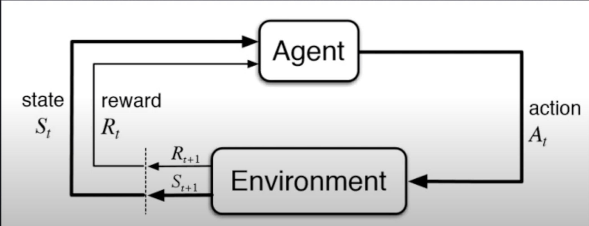
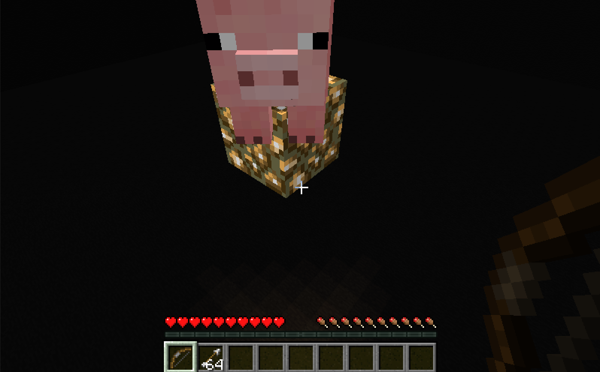
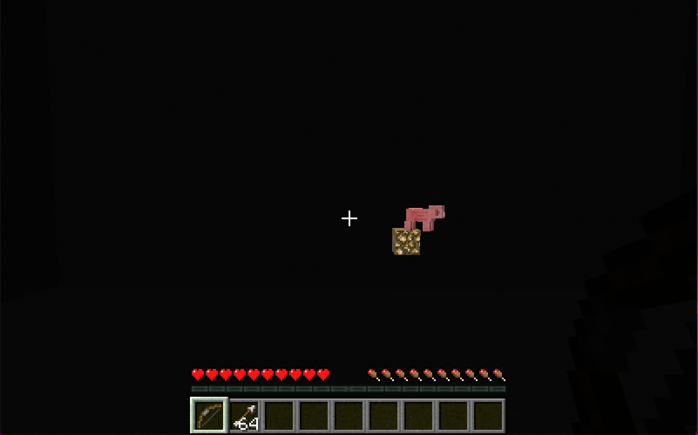
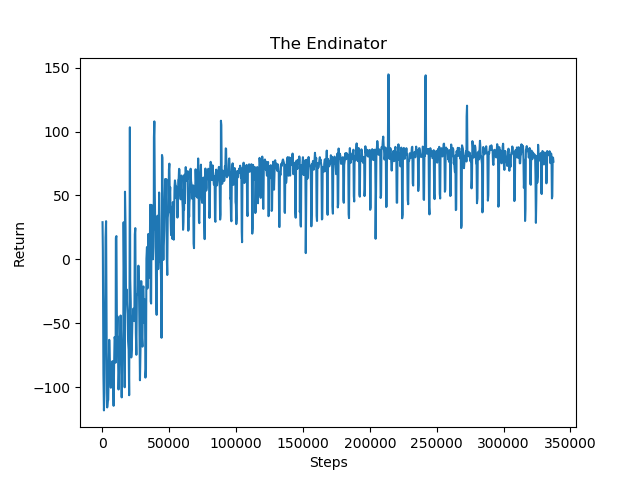
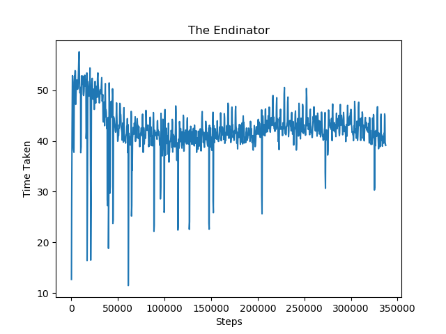
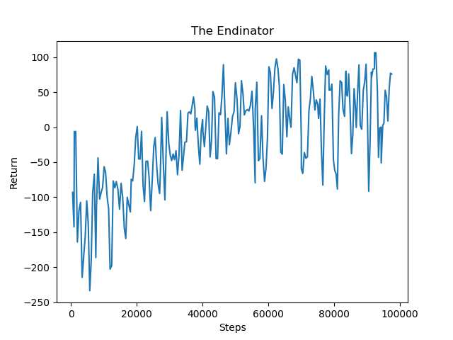

## Project Summary 

On the quest to defeat the final boss of Minecraft, players must first destroy all the ender crystals that lie atop large pillars in the dragon’s arena. To simulate this, the goal of our project is to utilize reinforcement learning with a custom environment in order to train our agent to accurately shoot objects at varying heights and distances with a bow. This process involves having the agent search for targets to shoot, as well as adjusting the vertical angle of their arrow in order to hit their targets. 

Since the Ender dragon’s environment consists of a circle of tall pillars with End crystals on top, our agent needs to figure out how to angle its arrow to hit the crystals. In addition, End crystals are placed at varying distances from the center of the circle of pillars, which emphasizes the importance of the agent learning how to adjust its shooting angle to accommodate for far distances. In order to simulate the beginning stages of the final boss fight, we created an environment with a pig on top of a single pillar that increases in distance and height based on a metric that changes during our three phase curriculum training. 

It’s very difficult to both find and hit a target that is at a far distance and a height not level with the agent. To begin with, finding the pig in a large and open world and within a reasonable time frame can prove to be a difficult task due to the noise of the environment. This is especially true when the pig is in a different location at the start of every new mission. Reinforcement learning is needed to slowly train the agent to become accustomed to locating and shooting the pigs at closer distances and similar heights before progressing to achieve our final goal height and distance. Our method of combining reinforcement learning with curriculum training will help the agent in gradually solidifying its ability to observe its surroundings, efficiently find the pig, and accurately angling the arrow to successfully kill the pig. Without AI/ML algorithms, there would be no way to quickly find the targets nor account for the shooting angle that should be used to hit the target after accounting for the distance and gravity of the arrow. 

## Approaches

### Baselines

Before training the agent, the agent will listlessly spin around unable to locate the pig no matter how much time is given. Based on our implementation, the agent is not allowed to shoot until the pig is within their line of sight, resulting in the agent never shooting an arrow when it’s unable to find a pig.

### Custom Environment Reinforcement Learning

The main algorithm we’re using to train our agent is reinforcement learning. We are utilizing the PPOtrainer of RLlib by creating our own custom environment. As shown in the image below, the agent is able to perform three actions (use, change pitch/yaw) that can result in a change in the state of the environment. The rewards based on that change will be collected and the agent will adjust its future actions accordingly to maximize the rewards it can receive. 

In order to train our agent using PPOtrainer, we passed in different parameters observed and calculated during the mission at each step to improve the agent’s choice of actions. Some of these observations include the calculated dot product of the normalization of the agent’s position and the pig’s position, the current yaw of the agent, and the current pitch of the arrow, which were passed to the agent for it to learn to adjust its direction and angle. 

### Rewards
In order for the agent to quickly improve on locating and accurately shooting the pig, we implemented multiple kinds of metrics that can provide rewards and punishments to the agent to influence its actions. 
<ul>
  <li> ObservationFromNearbyEntities (dot product of agent’s and pig’s positions) ~ [-0.6, 0.4] every step </li>
  <li> ObservationFromRay (allow_shoot = True) ~ 2 </li>
  <li> RewardForDamagingEntity ~ 15 per health point (90 in all for one shot) </li>
  <li> Time taken to kill the pig (negative reward for increasing time) ~ -0.1 per tick </li>
</ul>

### Environment
Our agent begins their mission on a floating block in the center of a large cube of stone with no light source aside from the pillar that the pig is standing on. Both the agent and the pig are 10 blocks above the ground so that when the pig is shot off of the pillar, it dies and triggers the mission’s ending condition. The agent is provided with a bow and 64 arrows which are used to shoot the pig that is placed on pillars of varying heights and distances. The height and distance of the pillars change throughout its curriculum learning and are determined by how many pigs have been shot throughout its training.

In our previous implementation, we created an environment involving a dense area of pigs surrounding the agent on pillars of varying heights and distances. However, upon observing our agent aiming for a pig, only for its arrow to miss and accidentally shoot a different pig, we decided to change the training environment. Our current environment is as described previously, which involves a single pig on a pillar in front of the agent that would change in heights and distances over the course of its curriculum training. This change was done so that the agent would only be rewarded for accurately shooting a pig that it was originally aiming at. While using only one pig may increase the time it needs to train, as well as complicate how to end each mission after the pig is shot, it trains an agent to find and shoot a pig more accurately than when the environment is congregated with many pigs. 

### Observation Space

self.observation_space = Box(-360, 360, shape=(self.obs_size,), dtype=np.float32)

In order to observe its line of sight and locate the pig, our agent uses ObservationFromRay to detect whether it’s looking at a pig and return a boolean value for allow_shoot. The disadvantage of using this observation method is that the scope of its observation is very narrow. It only returns true when the agent is looking directly at the pig but doesn’t know if the agent is close to looking at the pig. Therefore, we added ObservationFromNearbyEntities to obtain the position of nearby pigs within a specified grid. Using this observation, we were able to calculate the normalized dot product of the agent’s and pig’s relative positions to determine whether or not the agent is close to finding the pig. 

Using the positions of the pig and the agent we can draw two vectors. The first vector starts from the pig and points in the opposite direction of the agent while the second vector starts from the agent and points in the direction that the agent is looking. The result of the normalized dot product of these two vectors will equal one when the agent is looking in the direction of the pig, zero when the agent is looking perpendicular to the pig, and negative one when the agent is looking in the opposite direction of the pig. We used these normalized values as rewards to influence the agent to search in the right direction of the pig.  It would receive a positive reward when looking in the direction of the pig and a negative reward for looking in the opposite direction.

ObservationFromFullInventory and ObservationFromFullStats are used for statistical measures to obtain the number of arrows the agent used as well as the total number of mobs that were killed. The number of arrows used will be utilized in our quantitative visualization and the number of mobs killed is used as a metric of when to increase the difficulty of each mission in our curriculum training and to signal when to end the mission. 

### Action Space

self.action_space = Box(-1 / 3, 1 / 3, shape=(3,), dtype=np.float32)

There are an infinite number of states as our agent utilizes a continuous action space that consists of three actions: use [0 or 1], pitch [-1,1], and turn [-1,-1]. Our agent performs these three actions in order to transition from one state to another. The pitch adjusts the vertical angle the agent is looking at, the yaw/turn adjusts the horizontal angle (turning left and right), and the use of the bow is dependent on the observations received from the ObservationFromRay. When the agent finds a pig in its line of sight (from ObservationFromRay) and tries to use its bow, we send commands to freeze its movement, wait while it draws back its bow (for 1.1 seconds), adjust its pitch based on the speed that the agent has decided to change its pitch at (for 0.1 seconds), and fire the arrow. Otherwise, when the agent isn’t looking at a pig or if it does but decides not to use its bow, it simply turns and changes its pitch at the agent’s chosen speed in order to search for the pig in a continuous fashion. However, we’ve also decided to limit the agent’s pitch (from [-60 to 60]) to prevent the agent from looking directly up or down at its feet frequently in order to speed up the training process. We did this by preventing the agent from sending pitch commands to go upward when the agent’s pitch was already nearing directly above its head and not sending pitch commands to go downward when the agent’s pitch was already looking toward the ground. These limits were created carefully to ensure that they would not limit the agent too much to the point that it would prevent the agent from shooting at a tall target. 

### Curriculum Learning

To improve the quality of training that the agent receives in order to achieve its goal of  shooting at targets at varying heights and distances, we implemented curriculum learning with three phases. In each phase, the agent will need to successfully kill the pig three times per combination of height and distance before the difficulty advances. The advantage of this approach is to ensure that the agent’s ability to kill a pig is solid at a particular level before the height or distance is changed to increase difficulty. 

#### Phase 0
The first phase of the curriculum learning places a pig on a pillar directly in front of the agent at a distance of one block. The height of the pig will stay level with the agent throughout this phase while the distance between the pig and the agent will increase slowly by one block until the max distance of 30 blocks in between. 

           

#### Phase 1
The second phase of the curriculum learning places a pig on a pillar in front of the agent at a distance of 10 blocks away from the agent. The distance of the pig will remain constant during this phase with increasing height from a height level with the agent to 30 blocks above the agent.

#### Phase 2
The third phase of the curriculum learning places a pig on a pillar in front of the agent with varying height and distance. We randomly choose a number in the range 1 to 30 as the distance between the pig and the agent as well as a random number between 1 and 30 for the height of the pillar (beginning at the agent’s height). Each mission will have a randomized height and distance to test the agent’s versatility in any new setting.

## Evaluation

One quantitative measure we took to show that our agent is improving is the time it takes to successfully find and shoot the pig. Another method of quantitative evaluation is our graph that shows the number of rewards it was getting with every successive mission. 

In phase 0, we set the height of the pillar to be level with the agent and initialize the distance to be one block in front of the agent. As the agent successfully kills the pig, the distance of the pillar will continue to increase until it reaches 29 blocks away. We can see from the returns graph below that there is a steady increase in the number of returns from steps 0 to 80,000. This shows that the agent is successfully finding the pig and aiming at locations near the pig due to the reward of normalization. As the distance between the agent and the pig reaches 29 blocks, the pillar lets the agent continue to train at the max distance. The distance is maxed out at around step 80,000 and we can see that the returns begin to flatten. However it continues to retain the same level of rewards which shows that the agent is adequately trained in shots for far distances. 
In the time taken graph below, it measures the amount of time the agent needs in each successive mission to successfully kill the pig. We can see that the amount of time needed to kill the pig from steps 0 to 80,000 decreases significantly. Similar to the returns graph above, the amount of time needed becomes steady around step 80,000 as the distance is maxed out. 

For phase 2, we included the returns graph to show the improvement during training. Since phase 2 consists of pigs at random combinations of distances and heights, the time taken graph would not be a good measure of improvement since both of the parameters are not gradually increasing in one direction. In the return graphs, we can see that the rewards start out low in the negative range. Since phase 2 consists of random heights and distances, it makes it very difficult for the agent to find the pig fast at the beginning of training compared to phase 0 and phase 1 where the distance and height increase by a fixed amount. The agent may wander around more and take a longer time to determine the location of the pig, contributing to the negative reward. However, we can see that there is an increasing trend that enters the positive reward range, nearing the same amount as phase 0 and 1. This shows that the agent improves greatly in taking less time to successfully locate the pig and shoot the pig to secure a positive reward even at random height and distance combinations.

#### Phase 0
           

#### Phase 1

#### Phase 2

