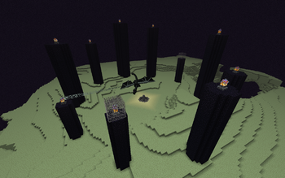

# ~Training to Defeat the Final Boss~

Our agent needs to defeat the final boss of the Minecraft world but fails to use his bow and arrow properly to shoot at the end crystals. 
In order to reach his goal in defeating the ender dragon, our agent starts to train with his bow and arrow, adjusting for vertical and horizontal angles 
as well as accomodating for different distances. Before he can advance to more difficult training, our agent begins with shooting at pigs at ground level 
of varying distances. In the future, our agent will need to train with different heights in order to succeed in breaking end crystals. Check out our status 
report to see how our agent performed in his first step towards the final boss!

Source code: https://github.com/elliejan99/TheEndinator

Reports:

- [Proposal](proposal.html)
- [Status](status.html)
- [Final](final.html)
