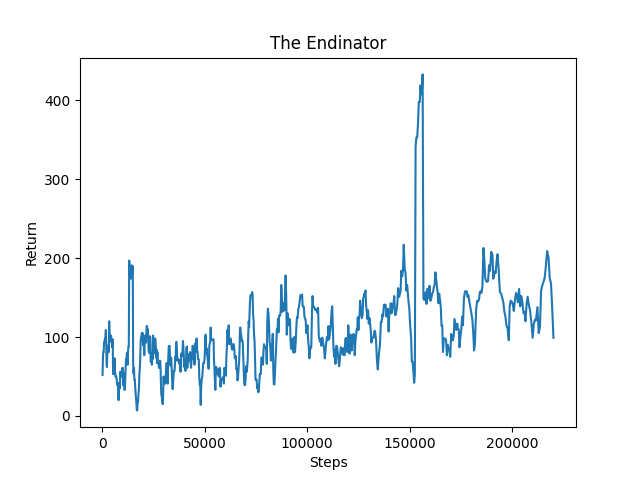

## Video Summary

<iframe width="600" height="350" src="https://www.youtube.com/watch?v=5POyuojgjSk&feature=youtu.be" frameborder="0" allow="accelerometer; autoplay; encrypted-media; gyroscope; picture-in-picture" allowfullscreen></iframe>

## Project Summary

On the quest to defeat the final boss of Minecraft, players must first destroy all the ender crystals that lie atop large 
pillars in the dragon’s arena. To simulate this, the goal of our project is to use reinforcement learning in order to train 
our agent to accurately shoot objects at varying heights and distances with a bow. This process involves having the agent look 
for objects to shoot, as well as adjusting the vertical and horizontal angle of their arrow in order to hit their targets. 

## Approach

The main algorithm that we’re using to train our agent is reinforcement learning. In the image below, it shows how our reinforcement algorithm works in order for our agent to improve its shooting. An action is made by the agent which is composed of continuous movements in adjusting turn, pitch, and use for the bow. Our environment will change based on our action and produce a reward depending on whether we missed (negative reward) or managed to shoot a pig (positive reward). The different states that result from our actions and the rewards will then be taken in by our agents to improve its future actions.
Our agent begins their mission in the center of a flat area surrounded by entities at varying heights and distances and is given a bow and several arrows. The agent mainly uses ObservationFromRay, to detect whether or not there’s an entity to shoot at in the center of their screen. We also utilize ObervationFromFullStats in order to keep track of the number of arrows that our agent has used.

There are an infinite number of states as our agent utilizes continuous movement. To transition from one state to another, the agent
takes three actions. The actions are changing pitch (looking up and down), changing turn (looking left and right), and deciding whether
or not to use their bow. The agent will always change their pitch and turn, but whether or not they use their bow is dependent on 
the observations received from ObservationFromRay. If there’s no entity to shoot in the agent’s line of sight, the agent will simply 
change their pitch and turn in order to look for an entity to shoot. However, if there is an entity in the agent’s line of sight, then 
the agent is permitted to shoot. Our agent freezes itself, adjusts the angle of its arrow vertically and horizontally, and releases its 
arrow. The sleep time for the agent is set to 1.2 in order to ensure that the agent has enough time to pull back its arrow and release 
it in the correct direction.

If the agent misses the target, they’re given a penalty of 1, and if the agent hits the target, they’re given a reward of 10. To implement
this, we penalized the agent for every arrow they used (ie. discarded) and rewarded it based on whether or not it did damage to an entity. 
Based on the rewards or punishments our agent receives, it updates its policy accordingly and slowly learns the best vertical and horizontal 
angle needed to hit its target. Our project utilizes the PPOtrainer from Rllib in order to maximize the number of entities damaged in a single run. 

## Evaluation

Qualitatively, we can evaluate our agent based on our observations of our agent’s performance during its training. For this milestone, we placed pigs on blocks that are closer in distance to the agent and of heights just a few blocks above and below the agent to help the agent engage in simpler training. In the beginning of its training, the agent often aims its bow down in the water or misses the pigs on the block. When it finally finds an entity to shoot, regardless of the distance, it would point its arrow right at it, resulting in the arrow falling short of targets at far distances. However, after training the agent for a period of time, we can see from the rewards graph below that the agent is able to identify at which height the blocks and pigs are placed and aims with a more accurate pitch. If the entity was further away, the agent would raise its arrow upwards slightly to account for the distance. Our rewards were able to increase over the large number of runs performed since the agent learned the height of the blocks and searched for entities placed on these blocks to shoot while adjusting the pitch and turn slightly to aim more accurately. 

Quantitatively, we can evaluate our agent based on the number of rewards it was getting with every successive mission. As we can see in the reinforcement learning rewards graph above, there is an increasing trend in the damage to entities, meaning that the agent was both finding and shooting entities more often over time. This indicates that the agent’s policy was improving over time as it learned to account for distance when adjusting the pitch and turn of its arrow. 

## Remaining Goals and Challenges

One of the most critical goals we have going forward is to change the primary algorithm that we’re using to train our agent from reinforcement learning to deep Q-learning. We believe that deep Q-learning would allow our agent to develop a better policy and allow for more ambitiously placed targets. We’ve done a few trials thus far, but concluded that we needed to do more research and changes to our code before deep Q-learning showed greater improvements over reinforcement learning. Additionally, our prototype has only been trained on targets at close heights and distances, so we hope to give it more experience with targets at further heights and distances as well. This ties in to our ultimate goal of having our agent be able to shoot targets on top of the tall and far pillars in the ender dragon’s domain. To test that, another goal we have is to create more fine-tuned maps that will enable us to systematically test our agent’s aim as each mission we currently train our agent on is randomized. Lastly, we hope to experiment with different hand-coded policies in order to figure out which yield the best results.

Some challenges we anticipate that we’ll face in the near future include finding more ways to evaluate our agent’s performance as well as 
figuring out what major changes will be needed in order to change the primary algorithm we use to train our agent. To begin with, we currently
evaluate our agent based on the number of hits and misses that result from the agent shooting its bow, but we’d like to be able to see the 
entire trajectory of our agent’s arrow as well as how well the agent is accounting for height and distance when aiming its arrow. We currently 
haven’t implemented a way to obtain such data, but by creating less-randomized maps as well as setting up a second agent to observe the trajectory 
of the first agent’s arrow, we may be able to gather this data. Furthermore, changing our primary training algorithm may require large changes to 
our code and research which may prove to be time-consuming.  But we hope to look into various libraries and other resources in order to make the 
change to deep Q-learning as smooth as possible.

## Resources Used

Deep Q Learning - https://keras-rl.readthedocs.io/en/latest/agents/overview/
Reinforcement Learning - https://docs.ray.io/en/master/rllib.html
Malmo XMl - http://microsoft.github.io/malmo/0.30.0/Schemas/MissionHandlers.html
Code & Discussion References - CampusWire, Assignment2
